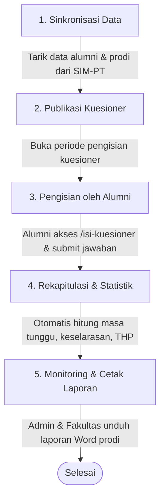

  

<h1 align="center">Tracer Study Universitas Nurul Jadid (UNUJA)</h1>

---

## 📌 Ringkasan Aplikasi

**Tracer Study UNUJA** adalah platform web untuk mendata dan melacak lulusan Universitas Nurul Jadid setelah menyelesaikan studi. Sistem ini mengukur indikator transisi alumni ke dunia kerja (waktu tunggu kerja, keselarasan studi, penghasilan, dan profil pekerjaan) guna memenuhi capaian **IKU 1 Perguruan Tinggi**.

---

## 👥 Pengguna & Hak Akses

| Peran                  | Tanggung Jawab Utama                                                                                                                                |
| :--------------------- | :-------------------------------------------------------------------------------------------------------------------------------------------------- |
| **Admin**              | Mengelola kuesioner, sinkronisasi data alumni/pegawai dari SIM-PT, import/export data, memantau statistik universitas, dan mencetak laporan tracer. |
| **Fakultas**           | Memantau daftar mahasiswa, respon alumni, analisis statistik, serta mengunduh laporan tracer khusus fakultas/prodi yang dibawahi.                   |
| **Mahasiswa / Alumni** | Mengakses kuesioner melalui portal `/isi-kuesioner`, mengisi survei tracer study, dan memperbarui riwayat pekerjaan.                                |

---

## 🔄 Alur Kerja Sistem (Garis Besar)

### Tahapan Alur:

1. **Sinkronisasi Data**: Admin menarik data master (Fakultas, Prodi, Tahun Akademik, dan Alumni) dari API SIM-PT UNUJA secara satu-klik.
2. **Pengelolaan Kuesioner**: Admin membuat atau mengaktifkan kuesioner tracer study dengan aturan alur pertanyaan bercabang (_skip logic_).
3. **Pengisian oleh Alumni**: Alumni masuk melalui `/isi-kuesioner` menggunakan NIM, lalu menjawab pertanyaan sesuai status (Bekerja, Wiraswasta, Lanjut Studi, atau Mencari Kerja).
4. **Pengolahan Data & Statistik**: Sistem secara otomatis mengolah jawaban responden ke dalam indikator IKU 1 (Rata-rata masa tunggu kerja `F502`, keselarasan vertikal/horizontal `F14` & `F15`, sebaran instansi, dll.).
5. **Cetak Laporan**: Admin dan Fakultas dapat mencetak dokumen laporan rekapitulasi tracer study berformat Microsoft Word (`.docx`) berdasarkan kuesioner, fakultas, atau prodi pilihan.

---

## 🧩 Modul & Fitur Utama

- **Kuesioner Dinamis**: Pengaturan pertanyaan bersyarat (_conditional skip logic_) dan fitur export/import kuesioner (JSON).
- **Integrasi SSO SIM-PT**: Tarik otomatis data master mahasiswa/alumni dan akun pengguna dari portal SIM-PT UNUJA.
- **Responden & Data Alumni**: Filter data mahasiswa (Fakultas, Prodi, Tahun Akademik), monitoring isian, dan batch import/export Excel.
- **Statistik & Dashboard**: Grafik interaktif capaian waktu tunggu kerja Belmawa, distribusi pekerjaan, pendapatan, keselarasan, dan sebaran wilayah.
- **Cetak Laporan Word**: Pembuatan dokumen rekapitulasi otomatis ke format `.docx` menggunakan template master dengan notifikasi SweetAlert.

---

  <b>Universitas Nurul Jadid (UNUJA)</b> 
  <i>Paiton, Probolinggo, Jawa Timur</i>

